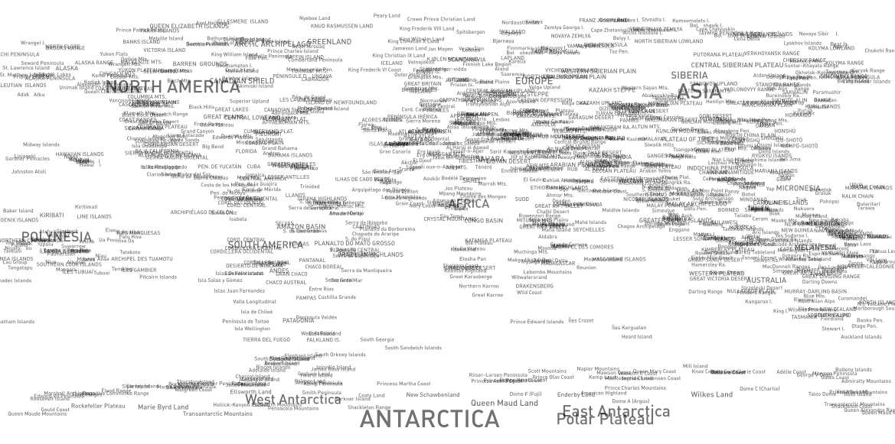
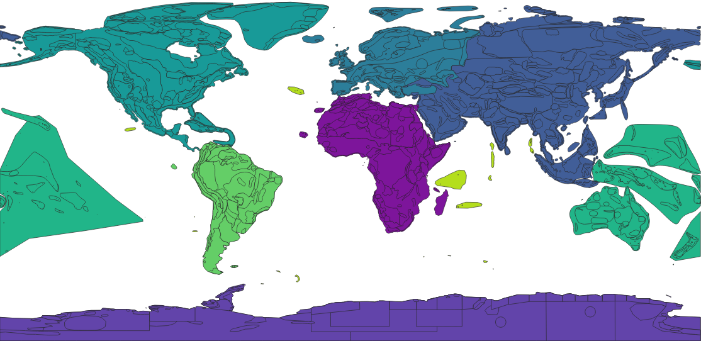

# OpenGeographyRegions
A project to create a free, global, crowdsourced, multilingual dataset of geographic regions. Typical usecase is drawing an oriented label at an approximate position and shape.

**This is work in progress, pull requests and other input are welcome.**

Just draw a geographic region that you know, add a reference to wikidata, and sent your pull request. A basic geojson editor can be found at [geojson.io](http://geojson.io/).

## Simple polygons, appropriate for different scales.
The project started with the 10m geography dataset from [natural earth](https://www.naturalearthdata.com/). There are currently 1052 features.

## Linked Data
The integration of wikidata allows for internationalization in many languages and provides semantic information beyond location.
Add a property "wikidata" with value "Q..." to reference a wikidata object.

## Open License
The license is CC0.

## Data in GeoJSON
The data is available in GeoJSON. Here is the [raw version](https://github.com/dieterdreist/OpenGeographyRegions/raw/master/geojson/geography_10m.geojson).

### geography_10m.geojson feature classes
Currently used feature classes (and usage count), derived from natural earth:

**geo shapes**
*   7 "continent"
*  68 "peninsula"
*  12 "delta"
*   4 "isthmus"
* 295 "island"
* 165 "archipel"

**geo climate**
*  58 "desert"
*   4 "tundra"
*   3 "wetlands"

**landscapes**
* 222 "mountain_range"
*  72 "plateau"
*  37 "coast"
*  30 "plain"
*   6 "valley"
*   5 "lowland"
*   9 "basin"
*   3 "foothills"
*   3 "lake"
*   3 "gorge"
*   2 "depression"

*  44 "geoarea"

### Editing conventions
Only use spaces, 2 spaces for each indentation level. Do not break the *geometry* value into lines so that the file becomes easier readable.
#### Properties
Stick to this property ordering to avoid unnecessary history cluttering.
* name
* namealt
* featureclass
* scalerank *(not sure this is needed, might be removed in a following version)*
* region
* subregion
* wikidata

#### Regions
* Africa
* Antarctica
* Asia
* Europe
* North America
* Oceania
* South America
* Seven seas (open ocean)

